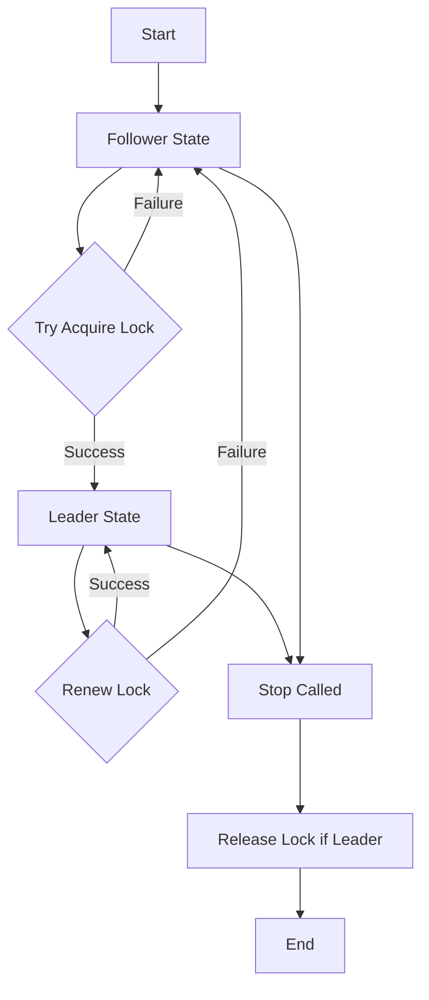

# Shard Coordinator


[](https://pkg.go.dev/github.com/gurre/shardcoordinator)
[](https://goreportcard.com/report/github.com/gurre/shardcoordinator)


A fault-tolerant distributed leader election library for Go applications with pluggable backends. This library implements a lease-based approach where coordinators continually renew their leadership to maintain control of logical shards.

Supports multiple storage backends:
- **DynamoDB** - Atomic operations with strong consistency
- **Route53** - DNS-based locking using atomic batch operations
- **Custom** - Implement the `Locker` interface for your own backend

## Features

- **Single Leader Guarantee**: Only one coordinator can lead a shard at any time using atomic operations
- **Instant Failover**: Leaders are replaced immediately when they become unavailable, with zero coordination gaps
- **Continuous Leadership**: Advanced TTL-based acquisition prevents service interruptions during leader transitions
- **Pluggable Backends**: Choose DynamoDB, Route53, or implement your own storage backend
- **Configurable Timing**: Adjust lease duration and renewal periods for your use case
- **Graceful Shutdown**: Leaders can voluntarily release locks for immediate handover
- **Minimal Dependencies**: Uses only AWS SDK v2 and standard library

## Installation

```bash
go get github.com/gurre/shardcoordinator
```

## Quick Start

### Using DynamoDB Backend

```go
import (
    "context"
    "fmt"
    "log"
    "os"
    "time"

    "github.com/aws/aws-sdk-go-v2/config"
    "github.com/aws/aws-sdk-go-v2/service/dynamodb"
    "github.com/google/uuid"
    "github.com/gurre/shardcoordinator"
    "github.com/gurre/shardcoordinator/dynamolock"
)

func main() {
    // Load AWS configuration
    awsConfig, err := config.LoadDefaultConfig(context.TODO())
    if err != nil {
        log.Fatalf("Failed to load AWS config: %v", err)
    }

    // Create DynamoDB locker
    dynamoClient := dynamodb.NewFromConfig(awsConfig)
    locker, err := dynamolock.New(dynamolock.Config{
        Table:  "coordination-table",
        Client: dynamoClient,
    })
    if err != nil {
        log.Fatalf("Failed to create locker: %v", err)
    }

    // Generate unique owner ID
    hostname, _ := os.Hostname()
    ownerID := fmt.Sprintf("%s-%d-%s", hostname, os.Getpid(), uuid.New().String())

    // Create coordinator
    coordinator, err := shardcoordinator.New(shardcoordinator.Config{
        ShardID:       "batch-processor",
        OwnerID:       ownerID,
        LeaseDuration: 15 * time.Second,
        RenewPeriod:   5 * time.Second,
        Locker:        locker,
    })
    if err != nil {
        log.Fatalf("Failed to create coordinator: %v", err)
    }

    // Start coordination process
    ctx := context.Background()
    if err := coordinator.Start(ctx); err != nil {
        log.Fatalf("Failed to start coordinator: %v", err)
    }
    defer coordinator.Stop(ctx)

    // Main application loop
    for {
        if coordinator.IsLeader() {
            fmt.Println("I am the leader - processing work...")
            processWorkAsLeader()
        } else {
            fmt.Println("I am a follower - waiting...")
            time.Sleep(1 * time.Second)
        }
    }
}

func processWorkAsLeader() {
    // Only the leader executes this code
    time.Sleep(2 * time.Second)
}
```

### Using Route53 Backend

```go
import (
    "context"
    "fmt"
    "log"
    "os"
    "time"

    "github.com/aws/aws-sdk-go-v2/config"
    "github.com/aws/aws-sdk-go-v2/service/route53"
    "github.com/google/uuid"
    "github.com/gurre/shardcoordinator"
    "github.com/gurre/shardcoordinator/route53lock"
)

func main() {
    // Load AWS configuration
    awsConfig, err := config.LoadDefaultConfig(context.TODO())
    if err != nil {
        log.Fatalf("Failed to load AWS config: %v", err)
    }

    // Create Route53 locker
    r53Client := route53.NewFromConfig(awsConfig)
    locker, err := route53lock.New(route53lock.Config{
        HostedZoneID: "Z1234567890ABC",
        RecordPrefix: "lock",
        DomainName:   "coordination.example.com",
        Client:       r53Client,
    })
    if err != nil {
        log.Fatalf("Failed to create locker: %v", err)
    }

    // Generate unique owner ID
    hostname, _ := os.Hostname()
    ownerID := fmt.Sprintf("%s-%d-%s", hostname, os.Getpid(), uuid.New().String())

    // Create coordinator
    coordinator, err := shardcoordinator.New(shardcoordinator.Config{
        ShardID:       "batch-processor",
        OwnerID:       ownerID,
        LeaseDuration: 15 * time.Second,
        RenewPeriod:   5 * time.Second,
        Locker:        locker,
    })
    if err != nil {
        log.Fatalf("Failed to create coordinator: %v", err)
    }

    // Start coordination and run
    ctx := context.Background()
    if err := coordinator.Start(ctx); err != nil {
        log.Fatalf("Failed to start coordinator: %v", err)
    }
    defer coordinator.Stop(ctx)

    for {
        if coordinator.IsLeader() {
            fmt.Println("I am the leader - processing work...")
            processWorkAsLeader()
        } else {
            fmt.Println("I am a follower - waiting...")
            time.Sleep(1 * time.Second)
        }
    }
}

func processWorkAsLeader() {
    // Only the leader executes this code
    time.Sleep(2 * time.Second)
}
```

## Examples

For complete, runnable examples demonstrating leader election in practice:

- **[Route53 Example](cmd/r53example/)** - Complete application showing Route53-based leader election with graceful shutdown, state transitions, and AWS setup verification. Run with `go run ./cmd/r53example --help`.

## Backend Options

| Backend | Consistency | Performance | Cost | Use Case |
|---------|-------------|-------------|------|----------|
| **DynamoDB** | Strong | High | Pay per request | Production systems requiring strong consistency |
| **Route53** | DNS eventual | Medium | Pay per zone + queries | Geographic distribution, DNS-based discovery |

### DynamoDB Backend

**Advantages:**
- Strong consistency guarantees
- Sub-millisecond latency
- Proven at scale
- No DNS propagation delays

**Setup:**

```bash
aws dynamodb create-table \
    --table-name coordination-table \
    --attribute-definitions \
        AttributeName=pk,AttributeType=S \
        AttributeName=sk,AttributeType=S \
    --key-schema \
        AttributeName=pk,KeyType=HASH \
        AttributeName=sk,KeyType=RANGE \
    --billing-mode PAY_PER_REQUEST \
    --time-to-live-specification \
        Enabled=true,AttributeName=ttl \
    --region ${AWS_REGION}
```

**IAM Permissions:**

```json
{
    "Version": "2012-10-17",
    "Statement": [
        {
            "Effect": "Allow",
            "Action": [
                "dynamodb:PutItem",
                "dynamodb:UpdateItem",
                "dynamodb:DeleteItem"
            ],
            "Resource": "arn:aws:dynamodb:*:*:table/coordination-table"
        }
    ]
}
```

### Route53 Backend

**Advantages:**
- No additional AWS services required if you already use Route53
- DNS-based discovery (locks visible via DNS queries)
- Can work across AWS accounts with delegated zones

**Setup:**

1. Create a hosted zone (or use existing):

```bash
aws route53 create-hosted-zone \
    --name coordination.example.com \
    --caller-reference $(date +%s)
```

2. Note the Hosted Zone ID from the output (format: `Z1234567890ABC`)

**IAM Permissions:**

```json
{
    "Version": "2012-10-17",
    "Statement": [
        {
            "Effect": "Allow",
            "Action": [
                "route53:ChangeResourceRecordSets",
                "route53:ListResourceRecordSets"
            ],
            "Resource": "arn:aws:route53:::hostedzone/Z1234567890ABC"
        }
    ]
}
```

**How Route53 Locking Works:**

Route53 uses atomic batch operations for compare-and-swap semantics:

1. **Read:** List the TXT record for `{prefix}.{shardID}.{domain}`
2. **Parse:** Extract owner ID and TTL epoch from record value: `"{ownerID} {epochUnix}"`
3. **Check:** If epoch > now, lock is held (return false)
4. **Atomic Write:** ChangeResourceRecordSets with batch:
   - **DELETE:** Old record with exact value match
   - **CREATE:** New record with updated owner and epoch

If the DELETE fails (record changed), the entire batch rolls back, ensuring only one coordinator wins.

**DNS Record Format:**
- Name: `lock.{shardID}.coordination.example.com`
- Type: TXT
- Value: `"worker-1 1704067200"` (owner ID + epoch timestamp)
- DNS TTL: 60 seconds (application TTL is in the epoch value)

### Custom Backend

Implement the `Locker` interface to use your own storage backend:

```go
type Locker interface {
    // TryAcquire attempts atomic lock acquisition.
    // Returns true if acquired, false if already held with valid TTL.
    TryAcquire(ctx context.Context, shardID string, ownerID string, ttl time.Time) (bool, error)

    // Renew extends lock TTL if caller is the owner.
    // Returns true if renewed, false if ownership changed.
    Renew(ctx context.Context, shardID string, ownerID string, ttl time.Time) (bool, error)

    // Release deletes lock if caller is the owner.
    // Returns error only for infrastructure failures.
    Release(ctx context.Context, shardID string, ownerID string) error
}
```

**Requirements:**
- Atomic compare-and-swap semantics
- TTL-based expiration
- Owner validation
```

## Configuration

### Coordinator Config Fields

| Field | Type | Required | Description |
|-------|------|----------|-------------|
| `ShardID` | `string` | Yes | Logical identifier for the shard/resource |
| `OwnerID` | `string` | Yes | Unique identifier for this worker instance |
| `LeaseDuration` | `time.Duration` | Yes | How long leadership lasts without renewal |
| `RenewPeriod` | `time.Duration` | Yes | How frequently to attempt lease renewal |
| `Locker` | `Locker` | Yes | Backend implementation (DynamoDB, Route53, or custom) |

### Timing Configuration Guidelines

The relationship between `LeaseDuration` and `RenewPeriod` significantly impacts system behavior:

| Scenario | LeaseDuration | RenewPeriod | Use Case |
|----------|---------------|-------------|----------|
| **Stable Systems** | 30s | 10s | Long-running processes, infrequent leader changes |
| **Balanced** | 15s | 5s | General purpose applications |
| **Fast Failover** | 10s | 3s | Critical systems requiring quick recovery |

**Key Rules:**
- `RenewPeriod` must be less than `LeaseDuration`
- Recommended ratio: `LeaseDuration` should be 3-4× `RenewPeriod`
- System tolerates network delays up to: `LeaseDuration - RenewPeriod`

## How Atomic Operations Guarantee Single Leader

### DynamoDB Backend

PutItem with `ConditionExpression = "attribute_not_exists(pk) OR (attribute_exists(pk) AND #t < :now)"` is an atomic compare-and-swap on the entire partition key. DynamoDB's serialization rule guarantees that when two or more writers hit the same item in the same millisecond:

1. It orders the writes one-after-another
2. The first writer sees the attribute as "not exists" (or expired TTL) and succeeds
3. All later writers see it as "exists and not expired" and their request fails with ConditionalCheckFailedException

Each caller treats "conditional-check failed" as "I am follower", so there is never a moment when two processes both believe they are leader. The winner knows it succeeded because PutItem returned 200 OK; the losers know they failed because the SDK surfaces the conditional error. There is no need for a read-back step that could introduce a window of uncertainty.

### Route53 Backend

Route53's ChangeResourceRecordSets processes the entire ChangeBatch as a transaction. The DELETE operation specifies the exact value to match:

1. **Coordinator A** reads: `"worker-1 1000"` (expired)
2. **Coordinator B** reads: `"worker-1 1000"` (expired)
3. **Coordinator A** submits batch:
   - DELETE `"worker-1 1000"` ✓ (matches current value)
   - CREATE `"worker-2 2000"` ✓ (executes after DELETE)
4. **Coordinator B** submits batch:
   - DELETE `"worker-1 1000"` ✗ (value changed to `"worker-2 2000"`)
   - CREATE `"worker-3 2000"` ✗ (doesn't execute, batch fails)

Result: Only Coordinator A acquires the lock. The atomic batch operation provides compare-and-swap semantics similar to DynamoDB's conditional operations.

### Advanced Features

**Instant failover on expiration**: The implementation uses an enhanced condition expression `"attribute_not_exists(pk) OR (attribute_exists(pk) AND #t < :now)"` that enables immediate takeover of expired leadership locks. This eliminates the typical "leaderless gap" problem found in simpler implementations that only check for non-existence.

**Zero-downtime leadership transitions**: When a leader crashes or becomes unavailable, new coordinators can claim leadership the moment the TTL expires, ensuring continuous coverage without waiting for DynamoDB's background cleanup processes.

## How Recovery Happens

| Phase | What the coordinator does | Observable effect |
|-------|---------------------------|-------------------|
| Renew fails (I/O error, timeout, or ConditionalCheckFailed) | Immediately transitions from leader to follower state | Leader stops running immediately |
| Still partitioned | Keeps trying tryAcquire as a follower. All calls will fail while the old lock row is present and unexpired | Only one leader exists; your demoted node stays passive |
| Lock row expires (TTL) or another node overwrites it | Regular tryAcquire eventually succeeds; this node may become leader again | System converges to exactly one leader |

## Leadership Lifecycle



## Failure Modes

This section catalogs known failure modes of the lock and leader election system. Understanding these boundaries helps operators configure appropriate timeouts, monitoring, and alerting.

### Coordinator Logic

| Failure | Trigger | Consequence | Source |
|---------|---------|-------------|--------|
| **Error-blind renewal** | Transient backend error (throttle, timeout) during `Renew()` | `renew()` returns false on any error, coordinator demotes to follower even though it may still hold the lease. Unnecessary leadership churn. | `coordinator.go:396-400` |
| **Zombie leader after loop panic** | Nil pointer or panic inside `loop()` goroutine | `IsLeader()` returns last state forever. No renewals happen, lease expires, another node takes over, but this node still reports leader. | `coordinator.go:343-383` |
| **Stop() skips Release() due to TOCTOU** | `loop()` acquires leadership between `Stop()`'s state read and context cancel | Lock held but never released. Stuck until TTL expiry. | `coordinator.go:315-336` |
| **Double Start()** | Caller invokes `Start()` twice | Second call overwrites `c.stop`, leaking first goroutine. Two loops run, causing unpredictable state transitions. | `coordinator.go:298-302` |
| **Stale leadership after parent context cancellation** | Parent context cancelled without calling `Stop()` | Loop exits, state stays `leader`, no release. `IsLeader()` returns true with expired lease. | `coordinator.go:352-353` |

### Clock & Timing

| Failure | Trigger | Consequence | Source |
|---------|---------|-------------|--------|
| **Clock skew between coordinators** | NTP drift >1s between nodes | One node sees lease expired while owner considers it valid. Premature acquisition or failed renewal. | `coordinator.go:388,397` |
| **NTP clock jump backward** | NTP step correction | Renew condition `#t >= :now` uses jumped-back `:now`. Valid lease appears expired, causing false demotion. Another node acquires — split brain until original's next renew tick. | `dynamolock/dynamolock.go:98`, `route53lock/route53lock.go:83` |
| **Slow response causing inter-tick lease expiry** | Network latency > `LeaseDuration - RenewPeriod` | Renew succeeds at backend but by the time next tick fires, lease already expired. Another node acquires. Brief split brain. | `coordinator.go:344,370` |
| **No jitter on tickers** | Multiple coordinators with identical config start near-simultaneously | Synchronized contention bursts (thundering herd) on every tick. | `coordinator.go:344,348` |

### Route53-Specific

| Failure | Trigger | Consequence | Source |
|---------|---------|-------------|--------|
| **Eventual consistency enabling lock theft** | `ListResourceRecordSets` returns stale data that matches current record value | DELETE+CREATE batch succeeds against a record that was just renewed by the actual leader. Split brain. | `route53lock/route53lock.go:116,275` |
| **API rate limit exhaustion** | >5 `ChangeResourceRecordSets` calls/sec per hosted zone | All lock operations fail. All coordinators demote to follower. Leaderless. | Route53 API limit |
| **OwnerID containing space** | OwnerID with space character (e.g. from hostname) | `parseRecordValue` splits on space, corrupts parsed owner. All ownership checks fail. Lock cannot be renewed or released. | `route53lock/route53lock.go:311-312` |

### DynamoDB-Specific

| Failure | Trigger | Consequence | Source |
|---------|---------|-------------|--------|
| **Throttling causes false demotion** | `ProvisionedThroughputExceededException` on renew | Error treated as renewal failure. Leader demotes unnecessarily. | `dynamolock/dynamolock.go:102-110` |
| **Duplicate ownerID across processes** | Two processes configured with same ownerID | Both can renew the same lock (condition checks `ownerId = :me AND #t >= :now`, both satisfy). No mutual exclusion. | `dynamolock/dynamolock.go:91` |

### Network & Infrastructure

| Failure | Trigger | Consequence | Source |
|---------|---------|-------------|--------|
| **Network partition from backend** | Full connectivity loss to DynamoDB/Route53 | Renewals fail, leader demotes. Lease expires. Zero leaders until connectivity restores. | `coordinator.go:376` |
| **Stop() hangs on slow Release()** | Backend slow or partitioned during shutdown | `Stop()` blocks indefinitely — no internal timeout on `Release()`. | `coordinator.go:332` |
| **Process crash without Stop()** | OOM kill, SIGKILL, power loss | No `Release()` called. Lock persists until TTL expires. Leaderless period = remaining TTL + follower acquisition interval. | `coordinator.go:304-336` |
| **Backend resource deleted or permissions revoked** | DynamoDB table deleted, IAM policy changed | All operations return infrastructure errors. Permanent leaderless state. | All lock implementations |
