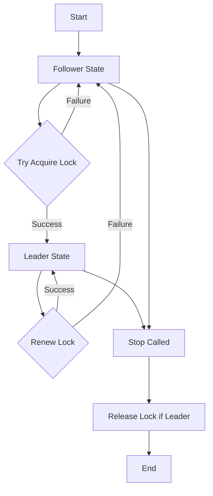

# Shard Coordinator

A fault-tolerant distributed leader election library for Go applications using DynamoDB as the coordination backend. This library implements a lease-based approach where coordinators continually renew their leadership to maintain control of logical shards.

## Features

- **Single Leader Guarantee**: Only one coordinator can lead a shard at any time using DynamoDB's atomic operations
- **Instant Failover**: Leaders are replaced immediately when they become unavailable, with zero coordination gaps
- **Continuous Leadership**: Advanced TTL-based acquisition prevents service interruptions during leader transitions
- **Configurable Timing**: Adjust lease duration and renewal periods for your use case
- **Graceful Shutdown**: Leaders can voluntarily release locks for immediate handover
- **Zero Dependencies**: Uses only AWS SDK v2 and standard library

## Installation

```bash
go get github.com/yourusername/shardcoordinator
```

## Quick Start

```go
func main() {
    // Load AWS configuration
    awsConfig, err := config.LoadDefaultConfig(context.TODO())
    if err != nil {
        log.Fatalf("Failed to load AWS config: %v", err)
    }

    // Generate unique owner ID
    hostname, _ := os.Hostname()
    ownerID := fmt.Sprintf("%s-%d-%s", hostname, os.Getpid(), uuid.New().String())

    // Create coordinator configuration
    cfg := shardcoordinator.Config{
        Table:         "coordination-table",     // DynamoDB table name
        ShardID:       "batch-processor",       // Logical shard identifier
        OwnerID:       ownerID,                 // Unique worker identity
        LeaseDuration: 15 * time.Second,        // How long leadership lasts
        RenewPeriod:   5 * time.Second,         // How often to renew
        AWS:           awsConfig,
    }

    // Create coordinator
    coordinator, err := shardcoordinator.New(cfg)
    if err != nil {
        log.Fatalf("Failed to create coordinator: %v", err)
    }

    // Start coordination process
    ctx := context.Background()
    if err := coordinator.Start(ctx); err != nil {
        log.Fatalf("Failed to start coordinator: %v", err)
    }
    defer coordinator.Stop(ctx)

    // Main application loop
    for {
        if coordinator.IsLeader() {
            fmt.Println("I am the leader - processing work...")
            processWorkAsLeader()
        } else {
            fmt.Println("I am a follower - waiting...")
            time.Sleep(1 * time.Second)
        }
    }
}

func processWorkAsLeader() {
    // Only the leader executes this code
    // Process queues, handle scheduled tasks, etc.
    time.Sleep(2 * time.Second)
}
```

## DynamoDB Table Setup

Create a DynamoDB table with the following schema:

```bash
aws dynamodb create-table \
    --table-name coordination-table \
    --attribute-definitions \
        AttributeName=pk,AttributeType=S \
        AttributeName=sk,AttributeType=S \
    --key-schema \
        AttributeName=pk,KeyType=HASH \
        AttributeName=sk,KeyType=RANGE \
    --billing-mode PAY_PER_REQUEST \
	--time-to-live-specification \
        Enabled=true,AttributeName=ttl \
    --region your-region
```

## Configuration

### Config Fields

| Field | Type | Required | Description |
|-------|------|----------|-------------|
| `Table` | `string` | Yes | DynamoDB table name for coordination |
| `ShardID` | `string` | Yes | Logical identifier for the shard/resource |
| `OwnerID` | `string` | Yes | Unique identifier for this worker instance |
| `LeaseDuration` | `time.Duration` | Yes | How long leadership lasts without renewal |
| `RenewPeriod` | `time.Duration` | Yes | How frequently to attempt lease renewal |
| `AWS` | `aws.Config` | Yes | AWS SDK v2 configuration |

### Timing Configuration Guidelines

The relationship between `LeaseDuration` and `RenewPeriod` significantly impacts system behavior:

| Scenario | LeaseDuration | RenewPeriod | Use Case |
|----------|---------------|-------------|----------|
| **Stable Systems** | 30s | 10s | Long-running processes, infrequent leader changes |
| **Balanced** | 15s | 5s | General purpose applications |
| **Fast Failover** | 10s | 3s | Critical systems requiring quick recovery |

**Key Rules:**
- `RenewPeriod` must be less than `LeaseDuration`
- Recommended ratio: `LeaseDuration` should be 3-4× `RenewPeriod`
- System tolerates network delays up to: `LeaseDuration - RenewPeriod`

## Why Only One Coordinator Can Win

PutItem with `ConditionExpression = "attribute_not_exists(pk) OR (attribute_exists(pk) AND #t < :now)"` is an atomic compare-and-swap on the entire partition key. DynamoDB's serialization rule guarantees that when two or more writers hit the same item in the same millisecond:

1. It orders the writes one-after-another
2. The first writer sees the attribute as "not exists" (or expired TTL) and succeeds  
3. All later writers see it as "exists and not expired" and their request fails with ConditionalCheckFailedException

Each caller treats "conditional-check failed" as "I am follower", so there is never a moment when two processes both believe they are leader. The winner knows it succeeded because PutItem returned 200 OK; the losers know they failed because the SDK surfaces the conditional error. There is no need for a read-back step that could introduce a window of uncertainty.

### Advanced Features

**Instant failover on expiration**: The implementation uses an enhanced condition expression `"attribute_not_exists(pk) OR (attribute_exists(pk) AND #t < :now)"` that enables immediate takeover of expired leadership locks. This eliminates the typical "leaderless gap" problem found in simpler implementations that only check for non-existence.

**Zero-downtime leadership transitions**: When a leader crashes or becomes unavailable, new coordinators can claim leadership the moment the TTL expires, ensuring continuous coverage without waiting for DynamoDB's background cleanup processes.

### Seamless Leadership Continuity

This library includes advanced lease acquisition logic that surpasses basic leader election implementations:

```
ConditionExpression = "attribute_not_exists(pk) OR (attribute_exists(pk) AND #t < :now)"
```

**Key Benefits:**
- **No service interruption**: Leadership transfers happen instantly when TTLs expire
- **Atomic operations**: Each acquisition is a single atomic PutItem with full consistency guarantees  
- **Superior to basic implementations**: Eliminates the coordination gaps that plague simpler `attribute_not_exists(pk)` approaches
- **Production-ready**: Handles real-world scenarios like network partitions and process crashes gracefully

## How Recovery Happens

| Phase | What the coordinator does | Observable effect |
|-------|---------------------------|-------------------|
| Renew fails (I/O error, timeout, or ConditionalCheckFailed) | Immediately transitions from leader to follower state | Leader stops running immediately |
| Still partitioned | Keeps trying tryAcquire as a follower. All calls will fail while the old lock row is present and unexpired | Only one leader exists; your demoted node stays passive |
| Lock row expires (TTL) or another node overwrites it | Regular tryAcquire eventually succeeds; this node may become leader again | System converges to exactly one leader |

### Why This Design Excels

- **Minimal split-brain exposure**: The longest a partitioned leader can "believe" it is still leader is one RenewPeriod, not the full LeaseDuration. The implementation immediately transitions to follower state on any renewal failure.

- **Instant state transitions**: When a renewal fails, the coordinator immediately flips its internal state to follower. Applications checking `IsLeader()` will see the state change right away, enabling rapid response to leadership changes.

- **Robust lock management**: The lock row stays intact until its TTL passes or another node overwrites it with the enhanced condition expression. DynamoDB's atomic conditions ensure only one owner at a time while enabling seamless handoffs.

### Optional Hardening

If you want still faster reaction to a lost lock, lower RenewPeriod for more frequent renewal attempts, or implement custom error handling and back-pressure strategies in your application logic.

## Leadership Lifecycle



### State Transitions

1. **Startup**: All coordinators start as followers
2. **Acquisition**: Followers periodically attempt to acquire leadership
3. **Leadership**: Leaders periodically renew their lease
4. **Failover**: Failed renewals cause automatic transition to follower
5. **Shutdown**: Graceful release of leadership during stop

## Best Practices

### Graceful Shutdown
Always call `Stop()` to release leadership cleanly:

```go
// Handle shutdown signals
c := make(chan os.Signal, 1)
signal.Notify(c, os.Interrupt, syscall.SIGTERM)

go func() {
    <-c
    log.Println("Shutting down...")
    coordinator.Stop(context.Background())
    os.Exit(0)
}()
```
